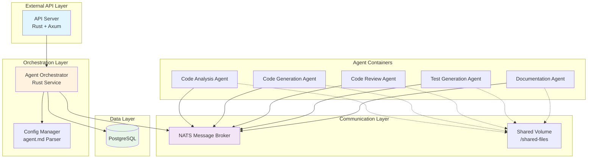

# Система Агентов для Кодинга на Rust

## Обзор

Это система специализированных агентов для кодинга, где каждый агент работает в отдельном Docker контейнере и выполняет свою уникальную функцию.

## Архитектура Системы



## Компоненты Системы

### 1. API Server (`api-server`)
- **Порт**: 8080
- **Функция**: REST API для взаимодействия с агентами
- **Технологии**: Rust + Axum

**Endpoints**:
- `POST /agents/{name}/execute` - Запуск агента с задачей
- `GET /agents/{name}/status` - Получение статуса агента
- `GET /agents` - Список всех активных агентов
- `POST /shared-files/upload` - Загрузка файлов в shared volume
- `GET /shared-files` - Список файлов в shared volume

### 2. Agent Orchestrator (`orchestrator`)
- **Порт**: 8081
- **Функция**: Координация работы агентов, управление жизненным циклом
- **Технологии**: Rust + Tokio

**Responsibilities**:
- Регистрация и отслеживание агентов
- Распределение задач между агентами
- Управление состоянием агентов в PostgreSQL
- Обработка сообщений от NATS

### 3. Agent Containers (`agent-{name}`)
Каждый агент работает в отдельном контейнере:

**Структура контейнера**:
```
agent-container/
├── src/
│   ├── main.rs          # Точка входа
│   ├── agent.rs         # Реализация Agent trait
│   ├── model.rs         # Загрузка LLM модели
│   └── tools.rs         # Инструменты агента (file ops, etc)
├── Dockerfile
└── agent.md             # Конфигурация роли агента
```

**Agent Trait**:
```rust
pub trait Agent {
    fn name(&self) -> &str;
    fn role(&self) -> &str;
    fn capabilities(&self) -> Vec<String>;
    
    async fn initialize(&self, config: AgentConfig) -> Result<()>;
    async fn run(&self, task: TaskRequest) -> Result<AgentResponse>;
    async fn stop(&self) -> Result<()>;
}
```

### 4. PostgreSQL (`postgres`)
- **Порт**: 5432
- **Функция**: Хранение state агентов и истории задач
- **Технологии**: PostgreSQL 16

**Основные таблицы**:
- `agents` - информация об агентах (name, role, status, config)
- `tasks` - задачи для выполнения
- `task_results` - результаты выполнения задач
- `messages` - история сообщений между агентами
- `shared_files` - метаданные файлов в shared volume

### 5. NATS (`nats-server`)
- **Порт**: 4222
- **Функция**: Асинхронный обмен сообщениями между агентами
- **Технологии**: NATS Server

**Topics**:
- `agent.*.task` - задачи для агентов
- `agent.*.result` - результаты выполнения задач
- `agent.*.status` - обновления статуса агентов
- `shared.files.*` - события файловой системы

### 6. Shared Volume (`/shared-files`)
- **Монтирование**: `/shared-files` во всех контейнерах
- **Функция**: Обмен файлами между агентами
- **Поддерживаемые типы**: исходный код, тесты, документация, артефакты

## Конфигурация Агентов (agent.md)

Каждый агент имеет свой файл конфигурации `agent.md`:

```markdown
# Agent Configuration

## Role Definition
role: code-generation
description: Generates code based on requirements and specifications

## Capabilities
- code_generation
- refactoring
- optimization

## Tools
- file_read
- file_write
- code_execution
- search_replace

## Model Configuration
model: codellama-13b
model_path: /models/codellama-13b
temperature: 0.7
max_tokens: 4096

## Communication
nats_subject: agent.code-generation
status_topic: agent.code-generation.status
result_topic: agent.code-generation.result

## Database Schema
schema:
  - table_name: generated_code
    columns:
      - name: id
        type: uuid
        primary_key: true
      - name: task_id
        type: uuid
        foreign_key: tasks.id
      - name: code_content
        type: text
      - name: file_path
        type: varchar(1024)
      - name: created_at
        type: timestamp
```

## Структура Проекта

```
aga/
├── api-server/              # API сервер на Rust
│   ├── Cargo.toml
│   ├── src/
│   │   ├── main.rs
│   │   ├── routes/         # API маршруты
│   │   ├── models/         # Data модели
│   │   └── middleware/     # Middleware
│   └── Dockerfile
│
├── orchestrator/            # Оркестратор агентов
│   ├── Cargo.toml
│   ├── src/
│   │   ├── main.rs
│   │   ├── agent_manager/  # Управление агентами
│   │   ├── nats_client/    # NATS клиент
│   │   └── db/             # PostgreSQL интеграция
│   └── Dockerfile
│
├── agents/                  # Шаблон агента
│   ├── template/           # Шаблон для генерации агентов
│   │   ├── Cargo.toml
│   │   ├── src/
│   │   │   ├── main.rs
│   │   │   ├── agent.rs
│   │   │   ├── model.rs
│   │   │   └── tools.rs
│   │   └── Dockerfile
│   └── configs/            # Примеры agent.md конфигураций
│
├── shared-files/           # Общий volume для файлов
│
├── docker-compose.yml      # Основной compose файл
│
├── README.md
└── ARCHITECTURE.md
```

## Запуск Системы

### 1. Сборка и запуск всех сервисов

```bash
docker-compose up -d --build
```

### 2. Создание агентов

```bash
# Создать агента на основе шаблона
./scripts/create-agent.sh code-generation

# Конфигурировать агента
cat > agents/code-generation/agent.md << EOF
# Agent Configuration

## Role Definition
role: code-generation
description: Generates code based on requirements

## Capabilities
- code_generation
- refactoring

## Model Configuration
model: codellama-13b
model_path: /models/codellama-13b
temperature: 0.7
EOF

# Запустить агента
docker-compose up -d agent-code-generation
```

### 3. Взаимодействие с API

```bash
# Запустить задачу для агента
curl -X POST http://localhost:8080/agents/code-generation/execute \
  -H "Content-Type: application/json" \
  -d '{
    "task": "Generate a Rust function to parse JSON",
    "context": "Need to parse user input from API requests"
  }'

# Проверить статус
curl http://localhost:8080/agents/code-generation/status
```

## Модель LLM

Модель настраивается через переменные окружения в контейнере агента:

```bash
docker run --env MODEL_NAME=codellama-13b \
           --env MODEL_PATH=/models/codellama-13b \
           agent-code-generation
```

Поддерживаемые модели:
- CodeLlama (13B, 7B)
- StarCoder
- DeepSeek-Coder
- Qwen-Coder

## Безопасность

- Все агенты работают в изолированных контейнерах
- Shared volume монтируется с ограничениями на запись
- NATS использует TLS для шифрования сообщений
- PostgreSQL использует отдельные учетные данные

## Мониторинг

```bash
# Просмотр логов всех сервисов
docker-compose logs -f

# Просмотр логов конкретного агента
docker-compose logs -f agent-code-generation

# Проверка статуса контейнеров
docker-compose ps
```
