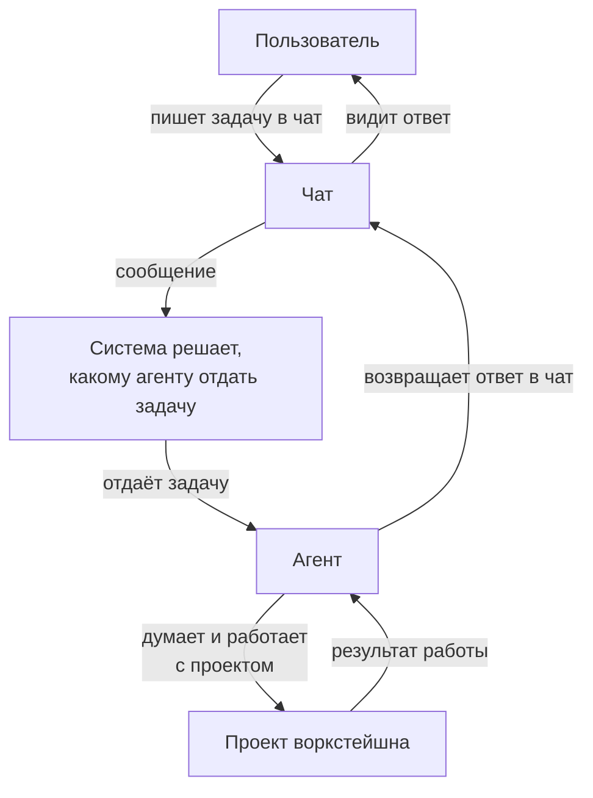
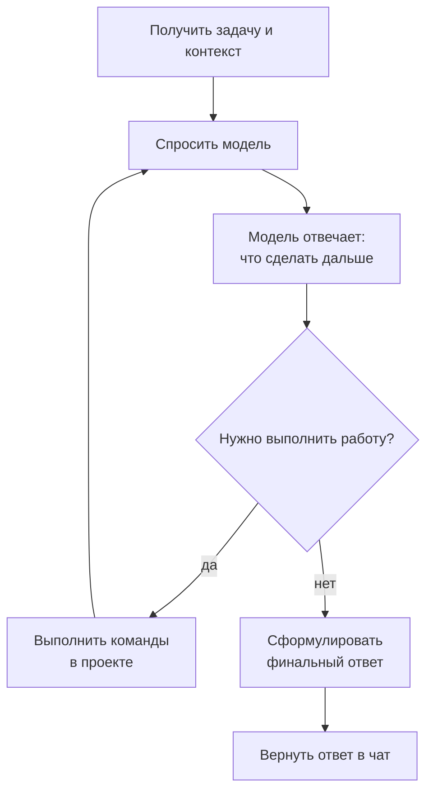

# Схема работы агента

## Общий поток

```mermaid
flowchart TD
    U[Пользователь]
    C[Чат]
    R[Система решает,<br/>какому агенту отдать задачу]
    A[Агент]
    P[Проект воркстейшна]

    U -->|пишет задачу в чат| C
    C -->|сообщение| R
    R -->|отдаёт задачу| A
    A -->|думает и работает<br/>с проектом| P
    P -->|результат работы| A
    A -->|возвращает ответ в чат| C
    C -->|видит ответ| U
```

Пока идёт работа, в чате появляются шаги агента — видно, что он делает.

## Цикл агента

```mermaid
flowchart TD
    START[Получить задачу и контекст] --> ASK[Спросить модель]
    ASK --> THINK[Модель отвечает:<br/>что сделать дальше]
    THINK --> WORK{Нужно выполнить работу?}
    WORK -->|да| DO[Выполнить команды<br/>в проекте]
    DO --> ASK
    WORK -->|нет| FINAL[Сформулировать<br/>финальный ответ]
    FINAL --> END[Вернуть ответ в чат]
```

Количество итераций ограничено, чтобы агент не зацикливался.