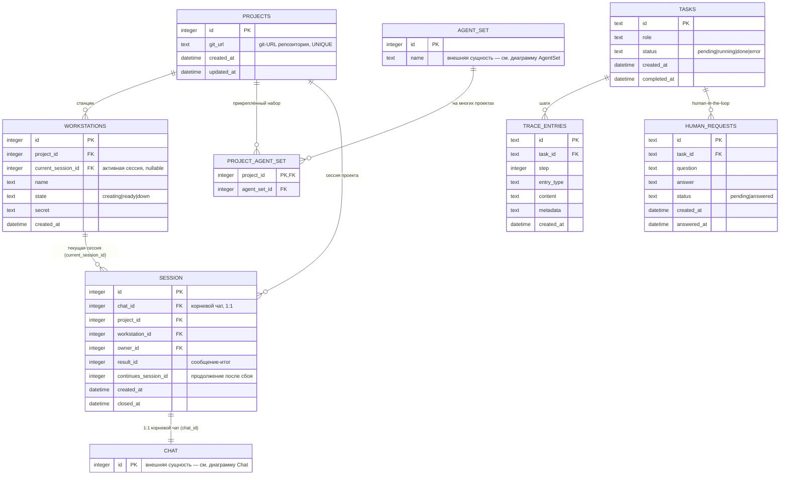
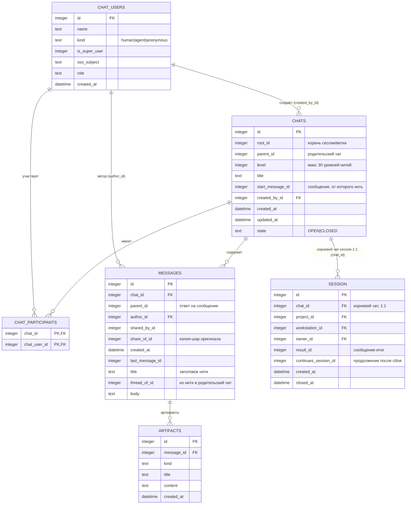
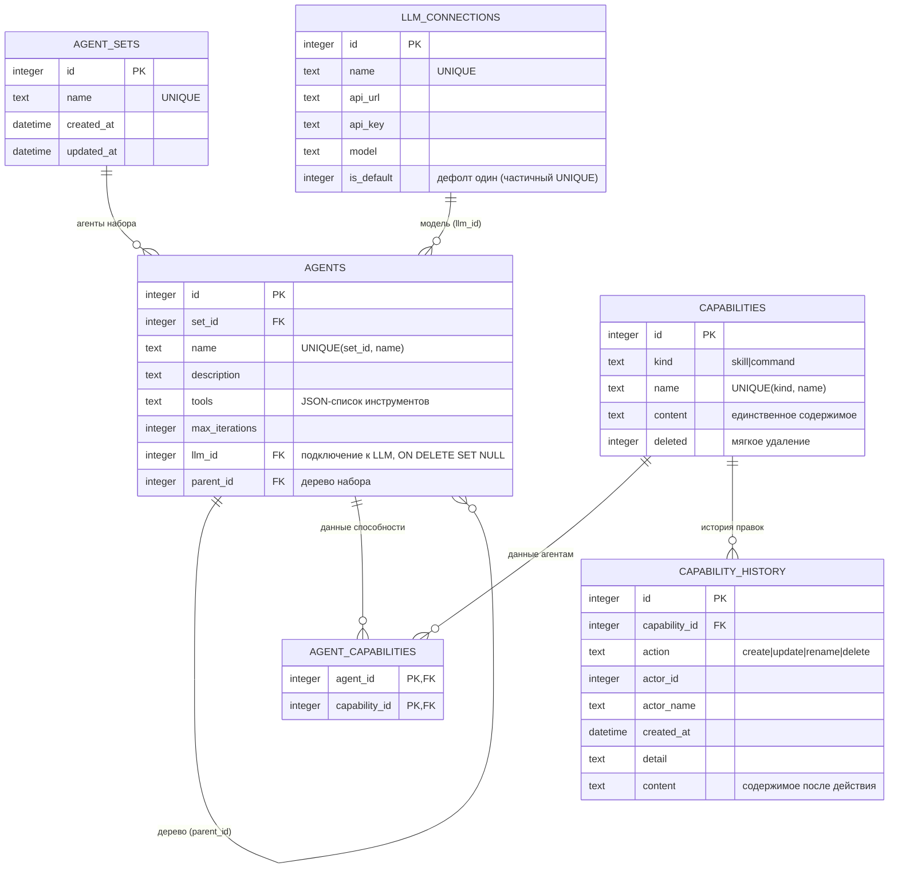

# ER-диаграмма базы данных aga

SQLite-БД ядра (`main/data/trace.db`, WAL). Схема создаётся в двух модулях:
`TraceStore` (`main/src/trace.rs`) и `ChatStore` (`main/src/chat.rs`) — одна БД.

## Основная диаграмма

Модель чата (`chat.rs`) и набор агентов (`trace.rs`) вынесены во внешние
сущности `CHAT` и `AGENT_SET` — на основной диаграмме видны только их связи с
остальными таблицами. Детали — в отдельных диаграммах ниже.

### Замечания

- **Session** — связующая сущность между проектом, чатом и воркстейшном:
  `project_id` связывает сессию с проектом напрямую, `chat_id` — 1:1 с корневым
  чатом (сессией), `workstation_id` — со станцией. Воркстейшн ссылается на
  активную сессию через `current_session_id` (NULL, когда свободен).
- Сессионные поля (`result_id`, `continues_session_id`) переехали из `chats` в
  `sessions`. `chats.state` остаётся в `chats` — он нужен и нитям.
- К проекту прикрепляется один набор агентов (`PROJECT_AGENT_SET`); один набор
  можно прикрепить к нескольким проектам. Детали набора — в диаграмме AgentSet.
- Задача (`tasks`) порождает шаги трассировки (`trace_entries`) и
  human-in-the-loop запросы (`human_requests`).

## Chat (внешняя сущность)

Модель чата (`main/src/chat.rs`): учётки, чаты (сессии/нити), участники,
сообщения и артефакты. Корневой чат воркстейшна — сессия.

### Замечания

- `chat_users` отделён от SSO: `sso_subject` связывает учётку с Keycloak, агенты
  и аноним-суперпользователь `kind` не имеют `sso_subject`.
- `chats.root_id` — корневой чат (сессия воркстейшна или общий чат); нити —
  дочерние чаты с `parent_id` и `start_message_id`.
- Корневой чат-сессия связан с `SESSION` 1:1 (см. основную диаграмму): через
  `sessions.project_id` проект чата достаётся напрямую, без транзита через
  воркстейшн. Общие чаты (`workstation_id` нет) сессии не имеют.
- `messages` самоссылается через `parent_id` (ответы) и `share_of_id` (шаринг).

## AgentSet (внешняя сущность)

Детали набора агентов: `agent_sets` — вершина, её агенты (дерево через
`parent_id`), данные способности из общего каталога (`capabilities`) и
подключения к LLM (`llm_connections`).

### Замечания

- Агенты набора образуют дерево через `parent_id`; территория агента — его узел.
- `capabilities` и `agent_capabilities` — связь «многие-ко-многим» по имени/записи;
  `capability_history` — журнал правок каталога.
- `llm_connections.is_default` — единственная дефолтная LLM (частичный уникальный
  индекс `WHERE is_default = 1`); удаление подключения сбрасывает `agents.llm_id` в NULL.